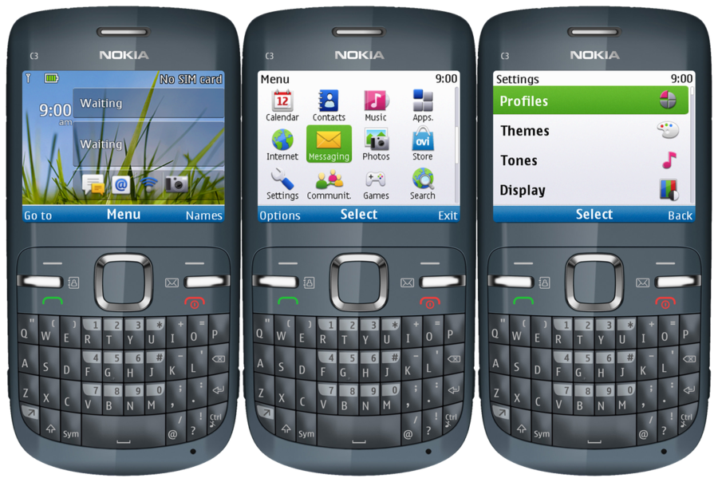
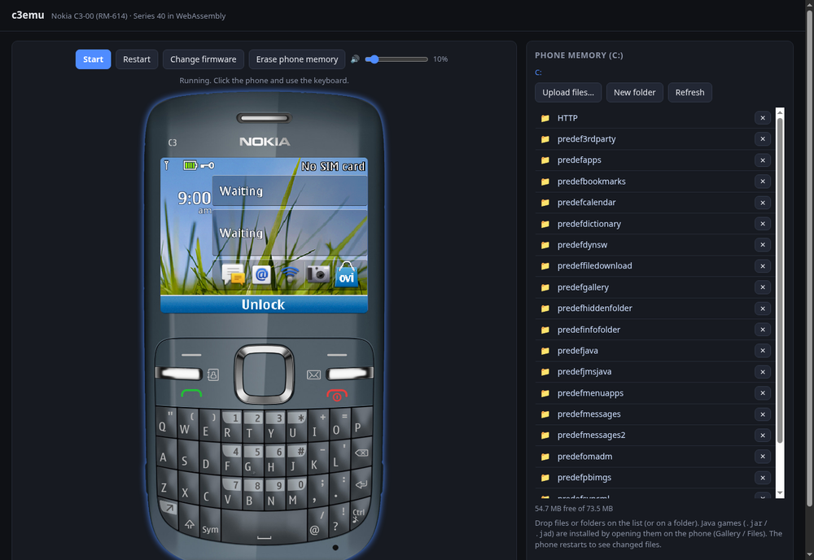

# c3emu

An emulator for the **Nokia C3-00** (RM-614) that boots the phone's own Series 40
operating system, on the desktop (Linux, Windows) and in the browser (WebAssembly).

> **Work in progress.** Expect bugs, missing features and changes.

**Try it in the browser: <https://androettop.github.io/c3emu/>** (bring your own firmware).



- Runs the stock Series 40 firmware: the CPU is an ARM926EJ-S interpreter written in
  Rust, around it the SoC devices the OS needs (timers, interrupt controller, display,
  keypad, DSP audio, PMU, real-time clock, flash storage, ...).
- The phone in a window, as in device simulators: resizable, keys clickable, PC keyboard
  mapped to the QWERTY keypad, sound.
- The phone's C: drive (phone memory) as files: the web version lets you browse it and
  drop games and other files into it.
- Deterministic: the emulated time is the exact instruction count, paced to real time;
  the same inputs give the same run.
- **No firmware is included.** You need the firmware files of your own phone.

## Firmware

c3emu needs the RM-614 firmware files:

| File | |
|---|---|
| `*.mcusw` | the operating system (required) |
| `*.ppm_*` | language pack (optional; menus in other languages) |
| `*.image_*` | factory content of the C: drive: themes, games, apps (optional) |

On the desktop, files named like the `.mcusw` next to it are picked up automatically.

## Desktop

Download a build from the Actions / Releases page, or build it:

```bash
# Linux: sudo apt install pkg-config libasound2-dev libx11-dev libxkbcommon-dev libwayland-dev
cargo build --release -p c3emu
./target/release/c3emu path/to/rm614__xx.xx.mcusw
```

The phone's flash (settings, installed apps, files) is kept in `./c3emu-data`
(`--storage DIR` to change it; delete it for a factory-fresh phone).

### Keys

| PC | Phone | PC | Phone |
|---|---|---|---|
| A–Z, Space, `.` `,` | QWERTY keys (r t y / f g h / v b n / m = 1–9) | Enter | D-pad centre |
| ← ↑ → ↓ | D-pad | F1 / F2 | left / right selection key |
| F3 | call | End | end call / power |
| F4 / F5 | contacts / messaging | F12 | Fn (unlock: Fn + left selection key) |
| Shift, Ctrl, F10 | shift, ctrl, Sym | Backspace / keypad Enter | backspace / QWERTY Enter |

A press shorter than 300 ms is a single key press, a longer one a long press. The keys
drawn on the phone can be clicked too.

## Web



> **Expect poor performance in the web version.** It runs the same interpreter compiled
> to WebAssembly, noticeably slower than the desktop build; animations drop frames and
> heavy apps can be slow.

Open <https://androettop.github.io/c3emu/>, or build and serve it yourself (below). Drop the firmware files on the phone screen and press *Start*. The right
panel shows the phone memory (C:): download or delete files, drop files or whole folders
on it (the phone restarts to see them). Java games (`.jar` / `.jad`) are installed by
opening them on the phone. Firmware and phone memory are kept in the browser
(IndexedDB); nothing is uploaded anywhere.

```bash
rustup target add wasm32-unknown-unknown
./scripts/build-web.sh                     # -> ./site
cargo run --release -p c3emu-web --bin serve   # http://localhost:8080
```

## Build options

| Feature | |
|---|---|
| `desktop` (default) | the `c3emu` app (window: minifb, sound: cpal) |
| `unicorn` | Unicorn (JIT) instead of the built-in interpreter: faster, follows the wall clock, not deterministic; needs CMake and a C compiler |
| `disasm` | disassembly in the debug reports (Capstone; needs a C compiler) |

`c3emu --headless` runs without a window; the debug options are listed at the top of
`crates/c3emu/src/bin/c3emu.rs`.

## Status

The phone boots to the home screen, menus, settings, themes, factory games and apps
work, with sound. There is no SIM card and no network (the phone starts "without SIM").
The interpreter runs at about 100 million instructions per second; the real phone's CPU
runs at 208 MHz, so under full load (e.g. while playing music) the emulator keeps sound
and clocks in real time and the display drops frames.

## License

c3emu is free software under the [GNU General Public License v3.0 or later](LICENSE).

The optional `unicorn` feature links Unicorn (GPLv2 only), which is not compatible with
GPLv3 or with the Apache-2.0 sound library: such builds are fine for your own use but
cannot be redistributed. The default builds (and the ones from CI) do not include it.

## Legal

c3emu is an independent project for interoperability and education, not affiliated with
or endorsed by Nokia or HMD Global. "Nokia" and "Series 40" are trademarks of their
owners. The repository contains no firmware or other code from the phone; use firmware
you are entitled to use.

